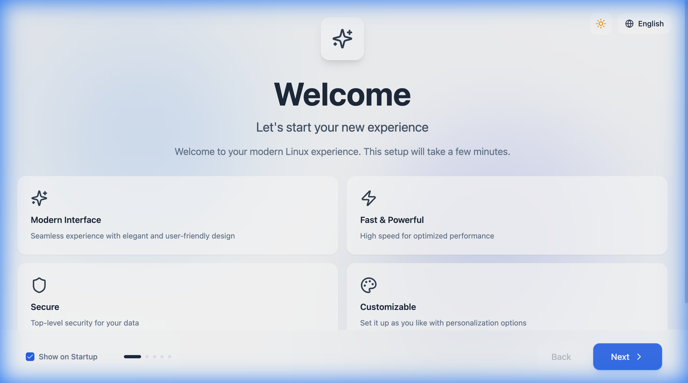
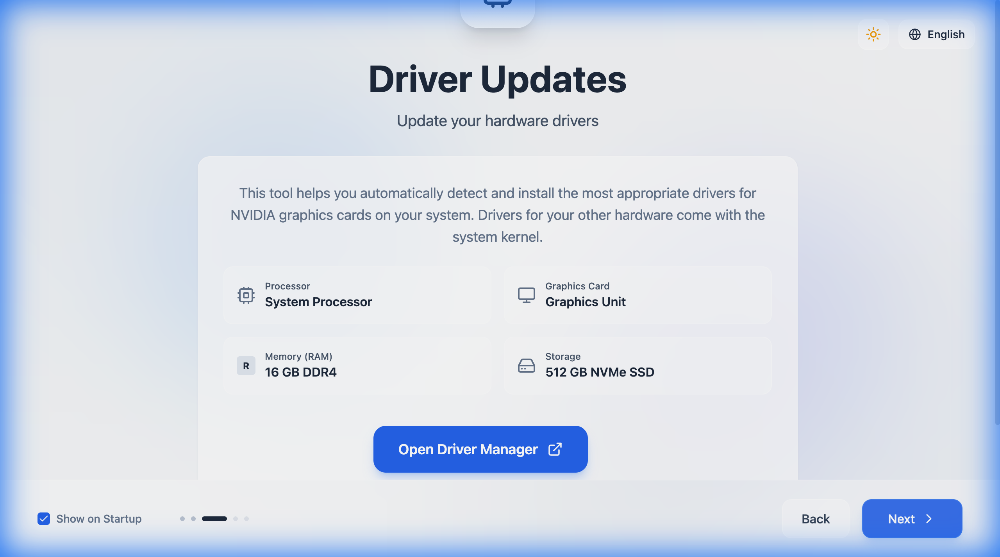

# 🚀 Ro-Start

[](README.tr.md)

> **A next-generation, transparent welcome application for Linux distributions.**

**Ro-Start** replaces traditional welcome screens with a modern, "Liquid Glass" aesthetic. Built with a hybrid architecture combining the system-level power of **Python (PyQt6)** and the reactive UI capabilities of **React (Vite + TailwindCSS)**, it creates a premium first impression for your Linux distro.



## ✨ key Features

- **🎨 Liquid Glass UI:** A stunning, transparent, and matte design language inspired by modern OS aesthetics.
- **🚀 Hybrid Architecture:**
  - **Backend:** Python + PyQt6 + QtWebEngine for limitless system access.
  - **Frontend:** React + TypeScript + Framer Motion for 60fps animations.
- **📊 System Canvas:** Beautiful visualization of CPU, GPU, RAM, and Storage statistics.
- **🎮 Driver Manager:** Simplified NVIDIA driver installation and management.
- **🌍 Adaptive:** Auto-detects system language and scales to different resolutions.
- **⚡ Autostart Ready:** Optional system startup integration.



## 🏗️ Project Structure

```
ro-start/
├── backend/           # 🐍 Python Backend (App Logic)
│   ├── core/          # System utilities, driver logic, specs
│   ├── ui/            # PyQt6 window and WebEngine setup
│   └── main.py        # Entry point
│
├── frontend/          # ⚛️ React Frontend (The Look)
│   ├── components/    # React components
│   ├── config/        # Frontend configuration
│   └── dist/          # Built static files (loaded by Python)
│
├── assets/            # 📦 Static Assets
│   └── locales/       # Translation files (i18n)
│
├── configs/           # ⚙️ Configuration Files
│   ├── app.json       # Application settings
│   └── distros.yaml   # Distribution-specific configs
│
├── scripts/           # 🔧 Build & Install Scripts
│   ├── install.sh     # Installation script
│   ├── build.sh       # Build script
│   └── pre-commit     # Git hook
│
├── tests/             # 🧪 Test Suite
│   ├── backend/       # Python tests (pytest)
│   └── frontend/      # React tests (vitest)
│
├── docs/              # 📚 Documentation
│   ├── ARCHITECTURE.md
│   ├── DEVELOPMENT.md
│   └── API.md
│
└── requirements.txt   # Python Dependencies
```

## 🛠️ Installation & Development

Follow these steps to set up the environment on your local machine.

### Prerequisites

- **Python 3.10+**
- **Node.js 18+ & npm** (for building the UI)
- **Linux Environment** (Recommended for full driver functionality, but runs on macOS/Windows in simulation mode)

### 1. Build the User Interface

The Python application loads the compiled HTML/CSS/JS. You must build the frontend first.

```bash
cd frontend
npm install
npm run build
cd ..
```

### 2. Set Up Python Environment

It is recommended to use a virtual environment.

```bash
# Create virtual environment
python3 -m venv venv
source venv/bin/activate

# Install dependencies (Editable mode recommended for dev)
pip install -e .
```

### 3. Run Ro-Start

Launch the application using the entry point or directly via python.

```bash
# Recommended
ro-start

# Or directly
python3 backend/main.py
```

> **Note:** If running on macOS or Windows, system-specific features like "Driver Installation" will run in **Simulation Mode** (mocked responses).

## 🤝 Contributing

Contributions are welcome! Whether it's adding support for a new distro (Arch, Fedora) or improving the "Liquid Glass" theme components.

1. Fork the repository
2. Create your feature branch (`git checkout -b feature/AmazingFeature`)
3. Commit your changes (`git commit -m 'Add some AmazingFeature'`)
4. Push to the branch (`git push origin feature/AmazingFeature`)
5. Open a Pull Request

## 📄 License

Distributed under the GNU General Public License v3.0. See `LICENSE` for more information.
